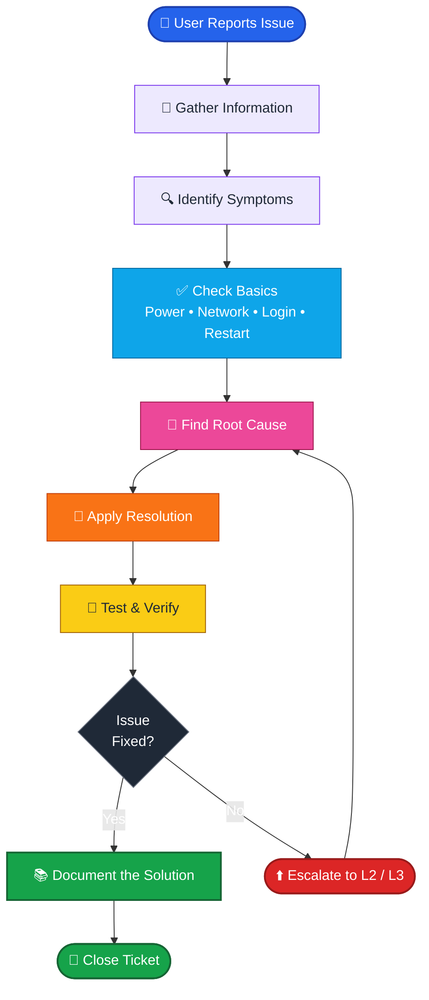
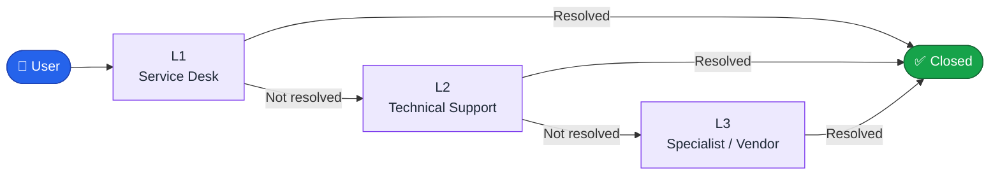

<!-- ========================= HEADER ========================= -->

  

  

  
  
  

---

<!-- ========================= ABOUT ME ========================= -->

## 👨‍💻 About Me

I'm an **IT Support Engineer** focused on reliable technical support, fast troubleshooting, clean incident resolution and smooth IT operations.

I enjoy solving problems across **Windows, networking, identity management, Microsoft 365, endpoint management and virtualization environments**.

<table>
<tr>
<td width="50%" valign="top">

### 🔧 Core Areas

- 🖥️ Windows & Desktop Support
- 🎫 Service Desk & Incident Management
- 🔐 Active Directory & Identity
- ☁️ Microsoft Entra ID & Microsoft 365
- 📱 Microsoft Intune & Endpoints
- 🌐 Network Troubleshooting

</td>
<td width="50%" valign="top">

### &nbsp;

- 🛠️ Hardware & Peripheral Troubleshooting
- 🐧 Linux Administration
- 💻 Virtualization & Home Labs
- ⚡ PowerShell & IT Automation
- 🛡️ Cybersecurity Fundamentals

</td>
</tr>
</table>

---

<!-- ========================= CURRENT FOCUS ========================= -->

## 🚀 Current Focus

| | Focus | |
|---|---|---|
| 🔭 | **IT Support Home Lab** | Building and documenting my own lab |
| 🌱 | **Cybersecurity & Endpoint Security** | Learning the fundamentals |
| 🧪 | **Windows Server & Active Directory** | Hands-on practice |
| ⚡ | **PowerShell** | Troubleshooting and automation |
| 🌐 | **Networking, TCP/IP & Packet Analysis** | Wireshark and lab practice |
| 🎫 | **Service Desk / ITSM Scenarios** | Practical ticket-based exercises |
| 🔐 | **Microsoft Defender for Endpoint** | Exploring |

---

<!-- ========================= GITHUB SUMMARY CARDS ========================= -->

## 📈 GitHub Profile Summary Cards

  

  
  

  
  

---

<!-- ========================= TROUBLESHOOTING WORKFLOW ========================= -->

## 🔧 IT Support Troubleshooting Methodology

### 🧭 Support Levels

---

<!-- ========================= IT SUPPORT STACK ========================= -->

## 🛠️ IT Support Stack

### 🎫 IT Service Management

  
  
  

### 🪪 Identity & Access Management

  
  
  

### ☁️ Microsoft Ecosystem

  
  
  
  

### 🖥️ Operating Systems

  
  
  
  
  

### ⚡ PowerShell & Command Line

  
  
  
  

### 🌐 Networking & Troubleshooting

  
  
  
  
  

### 💻 Virtualization & Home Lab

  
  

### 🛡️ Cybersecurity & Security Tools

  
  
  
  

---

<!-- ========================= SKILLS ========================= -->

## 🧠 Technical Skills

| Area | Skills |
|---|---|
| 🖥️ **Desktop Support** | Windows 10/11, Hardware, Drivers, Peripherals, Software Troubleshooting |
| 🔐 **Identity** | Active Directory, Microsoft Entra ID, User & Group Management |
| ☁️ **Microsoft 365** | Microsoft 365 Admin Center, Outlook, Teams, Office Applications |
| 📱 **Endpoint Management** | Microsoft Intune, Microsoft Defender for Endpoint |
| 🎫 **ITSM** | ServiceNow, Jira Service Management, Zendesk, Incident Management |
| 🌐 **Networking** | TCP/IP, DNS, DHCP, VPN, LAN/WAN, Wi-Fi, Ping, Tracert, Nslookup |
| 🐧 **Linux** | Ubuntu, Kali Linux, Linux Terminal, Basic Administration |
| ⚡ **Scripting** | PowerShell, Windows CMD, Bash |
| 💻 **Virtualization** | VMware Workstation, Hyper-V |
| 🔎 **Network Analysis** | Wireshark, Nmap, Cisco Packet Tracer, GNS3 |
| 🛡️ **Security** | Microsoft Defender, Security Fundamentals, Burp Suite, Kali Linux |
| 🧰 **Remote Support** | RDP, Quick Assist, TeamViewer, AnyDesk, Citrix |

---

<!-- ========================= FOOTER ========================= -->

<i>"Every ticket is a chance to make someone's day easier." ✨</i>

  

